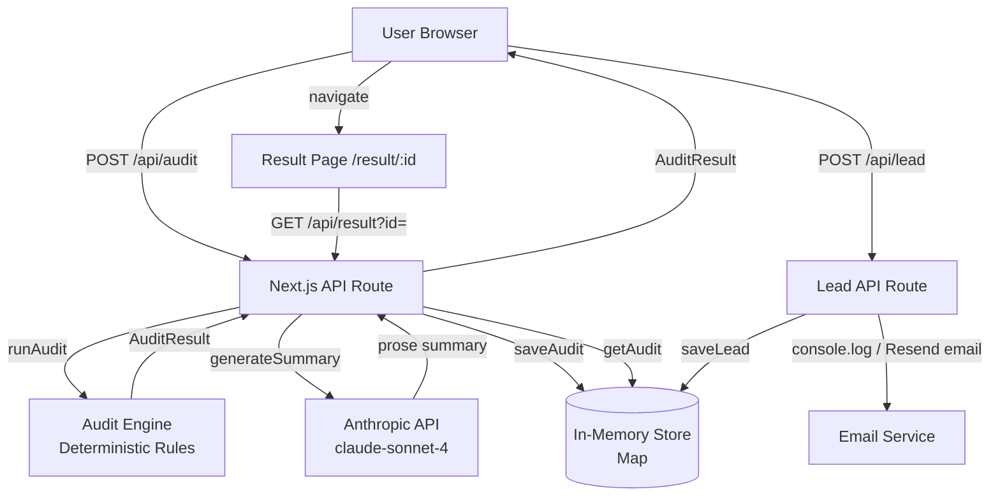

# Architecture

## System Diagram

## Data Flow

1. User fills the form → client collects `{tools[], teamSize, useCase}` → persists to `localStorage`
2. On submit, `POST /api/audit` with the input + empty honeypot
3. Server validates: honeypot empty, rate limit OK, at least 1 tool
4. `runAudit(input)` executes deterministic rules → `AuditResult` with per-tool recommendations
5. `generateSummary(audit)` calls Anthropic API → 80-120 word prose paragraph (fallback to template on failure)
6. Audit saved to in-memory store → `{id}` returned to client
7. Client navigates to `/result/:id`
8. Result page fetches `GET /api/result?id=` → renders breakdown + hero savings
9. Optional: user submits email → `POST /api/lead` → stored + email queued

## Stack choice

| Layer | Choice | Reason |
|---|---|---|
| Framework | Next.js 15 (App Router) | SSR for OG tags on result pages; API routes in same repo; zero config deploy on Vercel |
| Language | TypeScript | Type safety catches pricing/engine bugs at compile time; required for maintainability |
| Styling | Global CSS with CSS variables | No build-time dependency; fast iteration; the design system is a handful of tokens, not a component library |
| Storage | In-memory Map | Ship in 7 days; zero infra; interface is abstracted for easy swap |
| AI | Anthropic claude-sonnet-4 | Assignment requirement; SDK available; graceful fallback implemented |
| Testing | Jest + ts-jest | Standard; works without ESM complexity; 8 tests covering audit engine |
| CI | GitHub Actions | Native; free; deploys green checks on every push |

## Scaling to 10k audits/day

1. **Storage**: Replace `lib/storage.ts` with Supabase (Postgres) or Cloudflare D1. The `saveAudit`/`getAudit` interface is already abstracted — 1 file change.
2. **Rate limiting**: Move from in-memory to Redis (Upstash) — prevents per-instance bypass in serverless.
3. **AI summary**: Add a queue (Cloudflare Queues / BullMQ) to generate summaries async — don't block the audit response on LLM latency.
4. **Edge caching**: Result pages are read-heavy after sharing. Add `Cache-Control: s-maxage=3600` headers + Vercel Edge Cache for GET `/api/result`.
5. **Email**: Resend is already in the lead route as a `// TODO` — add `RESEND_API_KEY` env var and uncomment.
